# Distributed Job Scheduler

A Spring Boot based distributed job scheduler that accepts background jobs through a REST API, stores them durably in PostgreSQL, dispatches due jobs to Kafka, processes them with workers, and recovers from common failure modes such as Kafka outages, duplicate delivery, queued jobs that are never picked up, workers crashing mid-execution, Redis outages, and dead-letter publishing failures.

This project is being built as a practical system-design backend. The goal is not only to run jobs, but to show how production schedulers handle durability, retries, observability, and recovery.

---

## Architecture

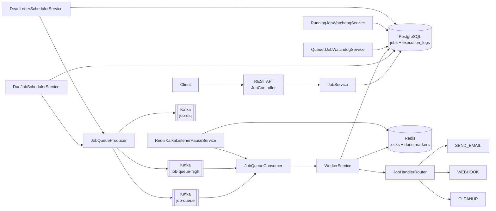

The API does not directly depend on Kafka being available. New jobs are written to PostgreSQL first with a `nextRunAt` value. A scheduler component later dispatches due jobs to Kafka. This keeps PostgreSQL as the source of truth and Kafka as the async delivery mechanism.

---

## Request Flow

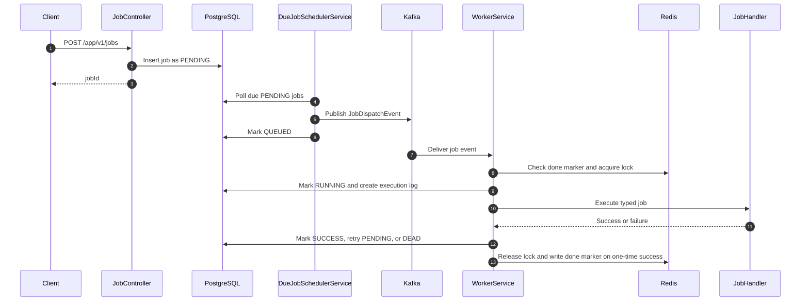

---

## Job Lifecycle

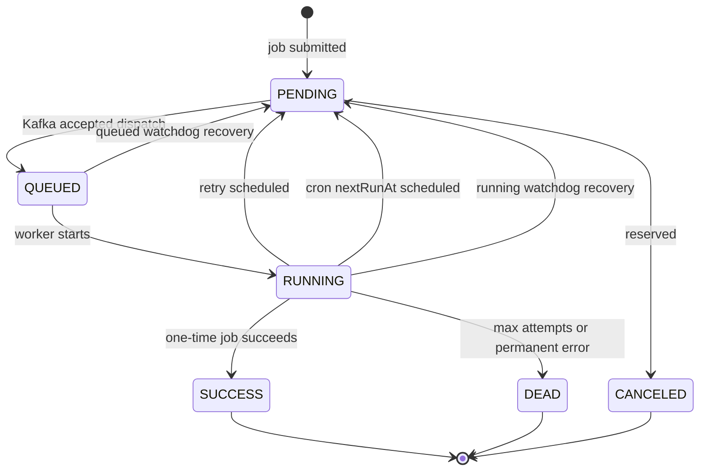

| Status | Meaning |
|---|---|
| `PENDING` | Stored in DB and waiting for `nextRunAt` |
| `QUEUED` | Kafka accepted the job, waiting for worker pickup |
| `RUNNING` | Worker has started processing |
| `SUCCESS` | Terminal success for one-time jobs |
| `FAILED` | Transitional failure before retry or `DEAD` |
| `DEAD` | Terminal failure after max attempts or permanent error |
| `CANCELED` | Reserved for future cancellation support |

---

## Implemented Flows

### Immediate Jobs

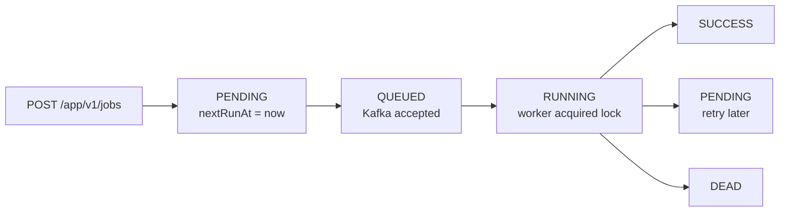

### Cron Jobs

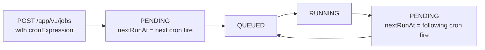

Spring cron expressions use 6 fields including seconds.

Example:

```text
0 */5 * * * *
```

Runs every 5 minutes.

### Retryable Failures

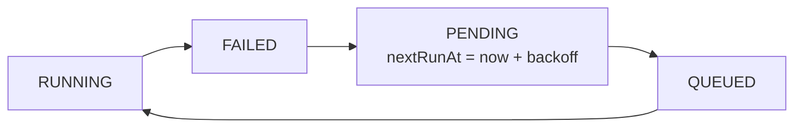

Retry delay grows as `1s, 2s, 4s...` and is capped by configuration.

### Permanent Failures

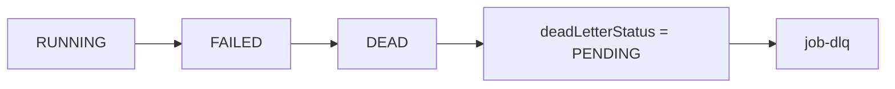

Permanent failures currently include missing jobs, invalid payloads, unsupported job types, and jobs that exceed their configured maximum attempts.

---

## Reliability Features

### DB-Backed Dispatch

Jobs are stored in PostgreSQL before Kafka dispatch. If Kafka is down when a job is submitted, the job is not lost. It remains `PENDING` and the due-job scheduler retries dispatch later.

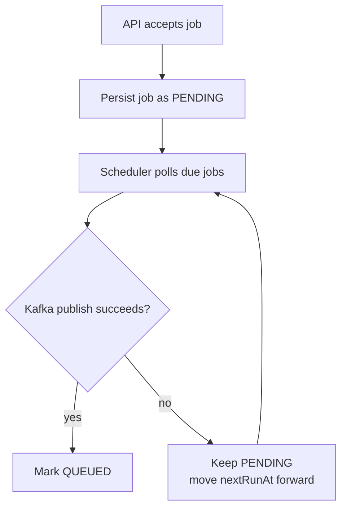

### QUEUED Watchdog

If Kafka accepts a job but no worker picks it up, the job can get stuck in `QUEUED`.


### RUNNING Watchdog

If a worker marks a job `RUNNING` and crashes, the job can stay `RUNNING`.

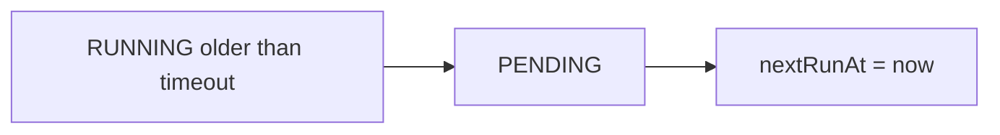

### Redis Locking With Lua

Workers use Redis locks to avoid duplicate execution. Lock release and renewal use Lua scripts so a worker only releases or renews a lock if it still owns the exact lock token.

Lock value format:

```text
workerId:randomUUID
```

This avoids deleting another worker's lock after TTL expiry and reacquisition.

### Redis-Aware Kafka Pause

Workers require Redis for locking and idempotency checks. `RedisKafkaListenerPauseService` periodically checks Redis health and pauses Kafka listener containers while Redis is unavailable, then resumes them when Redis is healthy again.

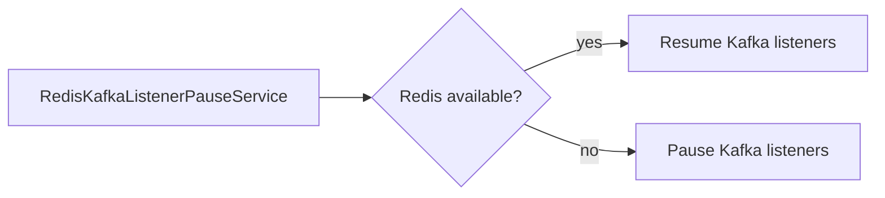

### Idempotency Marker

Successful one-time jobs write a Redis `job-done:{jobId}` marker. If Kafka redelivers the same message, the worker can skip already-completed work.

### Durable Dead-Letter Publishing

When a job reaches `DEAD`, the database stores dead-letter state on the job row. `DeadLetterSchedulerService` publishes pending dead-letter jobs to `job-dlq` and retries DLQ publishing if Kafka fails.

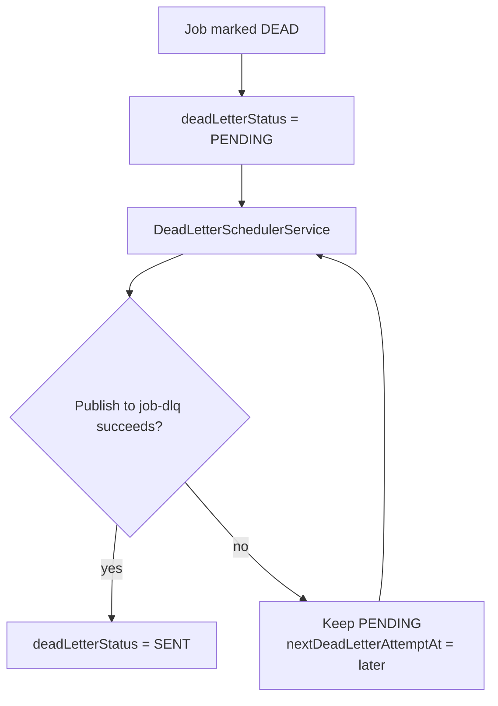

### External Call Timeouts

Webhook calls use configured connect/read timeouts. SMTP sends also have connection/read/write timeout properties to avoid pinning worker threads forever on stuck external dependencies.

---

## Scheduler Mode

Only one app instance should run scheduled DB polling in the current design.

Use:

```properties
scheduler.enabled=true
```

for the scheduler instance.

Use:

```properties
scheduler.enabled=false
```

for additional API/worker instances.

This avoids duplicate dispatch from multiple schedulers. A future improvement would be leader election or atomic DB row claiming.

---

## REST API

Base path:

```text
/app/v1/jobs
```

| Method | Path | Purpose |
|---|---|---|
| `POST` | `/app/v1/jobs` | Submit a job |
| `GET` | `/app/v1/jobs` | List jobs by newest first |
| `GET` | `/app/v1/jobs/dead` | List dead jobs |
| `GET` | `/app/v1/jobs/{jobId}` | Get job detail |
| `GET` | `/app/v1/jobs/{jobId}/logs` | Get execution logs for a job |
| `POST` | `/app/v1/jobs/{jobId}/requeue` | Create a new job from a dead job |

### Example Job Request

Immediate webhook:

```json
{
  "jobType": "WEBHOOK",
  "jobPriority": "HIGH",
  "payload": {
    "url": "https://example.com/webhook",
    "body": {
      "event": "demo"
    }
  },
  "maxRetries": 3,
  "idempotencyKey": "webhook-demo-001"
}
```

Recurring webhook:

```json
{
  "jobType": "WEBHOOK",
  "jobPriority": "MEDIUM",
  "cronExpression": "0 */5 * * * *",
  "payload": {
    "url": "https://example.com/webhook",
    "body": {
      "event": "cron-demo"
    }
  },
  "maxRetries": 3,
  "idempotencyKey": "webhook-cron-demo-001"
}
```

Cleanup job:

```json
{
  "jobType": "CLEANUP",
  "jobPriority": "LOW",
  "payload": {
    "olderThanDays": 30
  },
  "maxRetries": 3,
  "idempotencyKey": "cleanup-logs-30-days"
}
```

---

## Job Types

| Type | Status | Purpose |
|---|---|---|
| `SEND_EMAIL` | Implemented | Sends email through Spring Mail |
| `WEBHOOK` | Implemented | Sends HTTP POST with JSON payload |
| `CLEANUP` | Implemented | Deletes old execution logs |
| `REPORT` | Pending | Generate CSV/report output |
| `SCRAPE` | Pending | Fetch external job listings and store them |

Currently the router supports `SEND_EMAIL`, `WEBHOOK`, and `CLEANUP`.

---

## Persistence Model

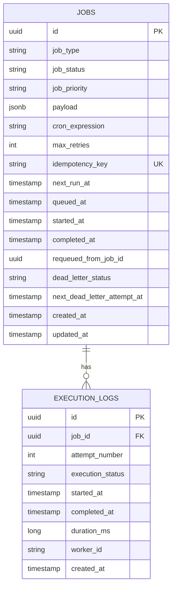

### jobs

One row per submitted job.

Important fields:

| Column | Purpose |
|---|---|
| `id` | Job identifier |
| `job_type` | Handler type |
| `job_status` | Lifecycle state |
| `job_priority` | `HIGH`, `MEDIUM`, or `LOW` |
| `payload` | JSON payload |
| `cron_expression` | Optional recurring schedule |
| `max_retries` | Currently treated as max total attempts |
| `idempotency_key` | Client-provided idempotency value |
| `next_run_at` | When scheduler should dispatch job |
| `queued_at` | When Kafka accepted the job |
| `started_at` | When worker began processing |
| `completed_at` | Terminal completion time |
| `last_error_message` | Last failure or watchdog recovery reason |
| `requeued_from_job_id` | Source dead job when manually requeued |
| `requeued_at` | Time a replacement job was created |
| `dead_letter_status` | DLQ publish state |
| `next_dead_letter_attempt_at` | Next DLQ publish retry time |

### execution_logs

One row per execution attempt.

Important fields:

| Column | Purpose |
|---|---|
| `job_id` | Parent job |
| `attempt_number` | Attempt count |
| `execution_status` | `RUNNING`, `SUCCESS`, or `FAILED` |
| `started_at` | Attempt start |
| `completed_at` | Attempt completion |
| `duration_ms` | Attempt duration |
| `error_message` | Failure reason |
| `worker_id` | Worker that handled the attempt |

---

## Kafka Topics

| Topic | Purpose |
|---|---|
| `job-queue` | Main job queue |
| `job-queue-high` | High-priority job queue |
| `job-dlq` | Dead letter queue |

High-priority jobs are dispatched to `job-queue-high`; all other priorities go to `job-queue`.

---

## Redis Keys

| Key | Purpose | TTL |
|---|---|---|
| `job-lock:{jobId}` | Worker execution lock | 30 seconds, renewed while running |
| `job-done:{jobId}` | Completed one-time job marker | 24 hours |

---

## Current Package Layout

```text
config/       HTTP client, Kafka topics, and Kafka error handling
constants/    Kafka topic names
consumers/    Kafka listeners
controller/   REST API
dto/          Request/event/response DTOs and payload records
entity/       JPA entities
enums/        JobStatus, JobType, JobPriority, DeadLetterStatus
exception/    Domain exceptions
handlers/     Per-job-type handlers and router
monitoring/   Redis-aware Kafka listener pause/resume
producers/    Kafka producer wrapper
repository/   Spring Data JPA repositories
scheduler/    Due-job dispatcher, watchdogs, and DLQ publisher
service/      Job lifecycle, worker, Redis lock, execution logs, Redis health
utility/      Key helpers
```

---

## Configuration

Core scheduler settings:

```properties
scheduler.enabled=true
scheduler.worker-id=worker-1
scheduler.retry.base-delay-ms=1000
scheduler.retry.max-delay-ms=30000
scheduler.due-job.poll-delay-ms=1000
scheduler.due-job.dispatch-retry-delay-ms=5000
scheduler.queued-watchdog.timeout-ms=300000
scheduler.queued-watchdog.poll-delay-ms=60000
scheduler.running-watchdog.timeout-ms=600000
scheduler.running-watchdog.poll-delay-ms=60000
scheduler.redis-health.poll-delay-ms=5000
scheduler.kafka.redis-retry-backoff-ms=5000
scheduler.dead-letter.poll-delay-ms=30000
scheduler.dead-letter.dispatch-retry-delay-ms=30000
```

Webhook timeout settings:

```properties
scheduler.webhook.connect-timeout-ms=5000
scheduler.webhook.read-timeout-ms=10000
```

Mail timeout settings:

```properties
spring.mail.properties.mail.smtp.connectiontimeout=5000
spring.mail.properties.mail.smtp.timeout=10000
spring.mail.properties.mail.smtp.writetimeout=10000
```

---

## What Is Done

- Job submission API
- Job list/detail APIs
- Execution log API
- Dead job listing API
- Manual requeue API for dead jobs
- Typed payload validation for email, webhook, and cleanup jobs
- PostgreSQL job and execution log entities
- Database indexes for scheduler and status queries
- DB-backed due-job dispatch
- Kafka producer and consumer flow
- High-priority and normal queue routing
- Durable dead-letter publishing with retry state in PostgreSQL
- Redis lock with Lua-based ownership-safe release/renew
- Redis idempotency marker for completed one-time jobs
- Redis health checks and Kafka listener pause/resume
- Execution logs per attempt
- Exponential backoff using `nextRunAt`
- Cron scheduling with Spring `CronExpression`
- QUEUED watchdog
- RUNNING watchdog
- Single-scheduler-instance flag
- Webhook and mail timeout configuration
- `SEND_EMAIL`, `WEBHOOK`, and `CLEANUP` handlers

---

## What Is Still Pending

Highest priority:

- Add proper runtime configuration for Kafka, Redis, PostgreSQL, and Mail
- Add tests for worker lifecycle, retry scheduling, cron scheduling, watchdogs, DLQ publishing, and handler routing
- Add Testcontainers for integration tests
- Add Docker Compose for local infrastructure
- Clarify `maxRetries` naming or rename it to `maxAttempts`

Feature roadmap:

- Implement `REPORT`
- Implement `SCRAPE`
- Add SSE live updates
- Add Redis status cache
- Add metrics: success rate, average duration, jobs per status/type
- Add GitHub Actions CI
- Add React dashboard

Production hardening:

- Replace single scheduler instance with leader election or atomic DB row claiming
- Add stronger concurrency protection around due-job claiming
- Add authentication/authorization for job management APIs
- Add structured API error responses
- Add pagination and filtering to list APIs

---

## System Design Talking Points

- The API is durable because it writes jobs to PostgreSQL before Kafka dispatch.
- Kafka is used for async worker fan-out, not as the only source of truth.
- `nextRunAt` makes immediate jobs, retries, and cron jobs use the same scheduling mechanism.
- `QUEUED` separates "Kafka accepted this" from "worker started this."
- `QUEUED` and `RUNNING` watchdogs recover from different failure windows.
- Redis locks protect against duplicate worker execution under at-least-once Kafka delivery.
- Lua scripts make Redis lock release and renewal ownership-safe.
- Redis health monitoring pauses Kafka listeners when locks cannot be trusted.
- Dead-letter state is persisted in PostgreSQL so failed DLQ publishes can be retried.
- Single scheduler mode avoids duplicate DB polling in the current version.

---

## Local Verification

Compile:

```bash
mvn -DskipTests compile
```

Full tests currently require local infrastructure such as PostgreSQL, Kafka, and Redis. Testcontainers or a test profile should be added before relying on `mvn test` in CI.
