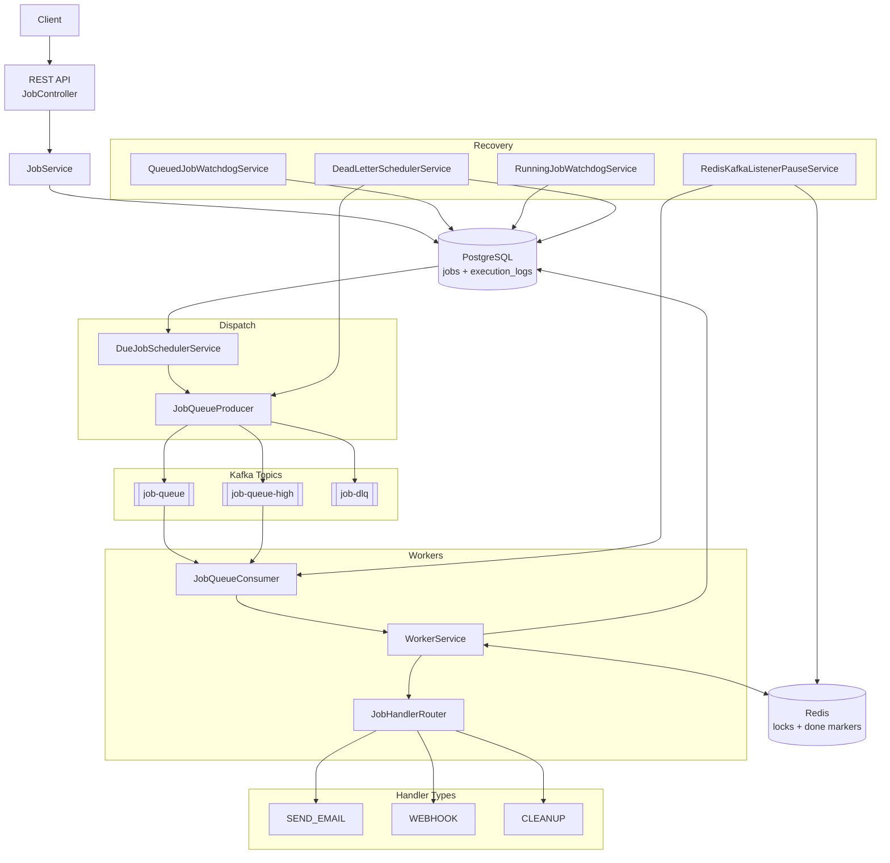
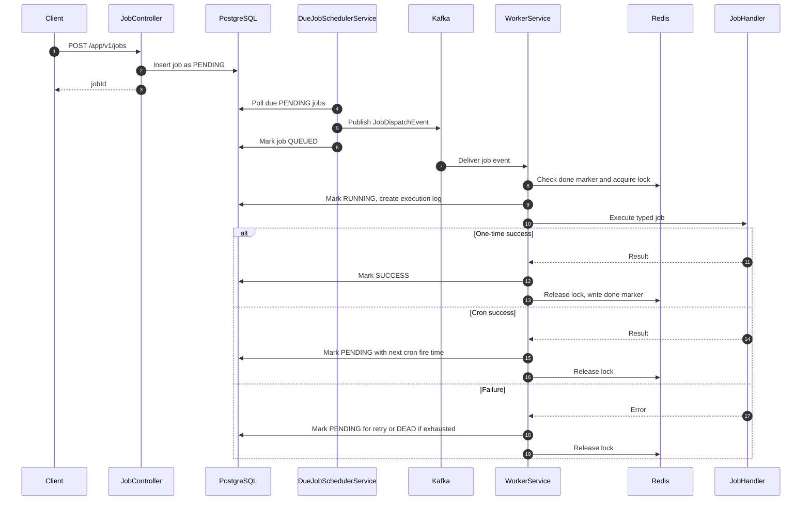
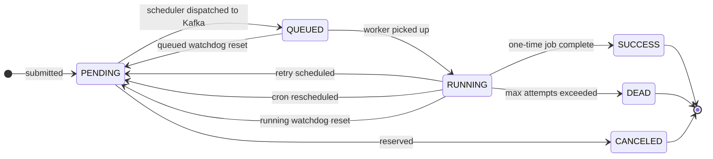
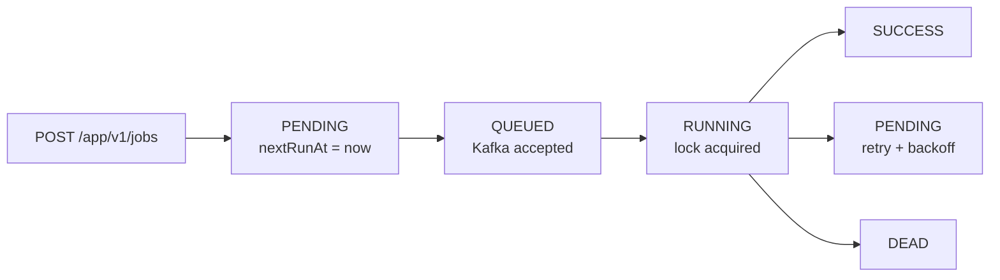
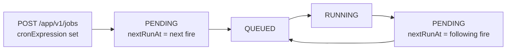
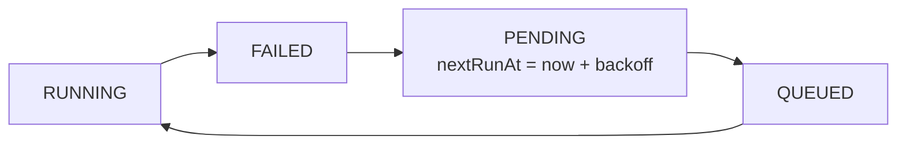
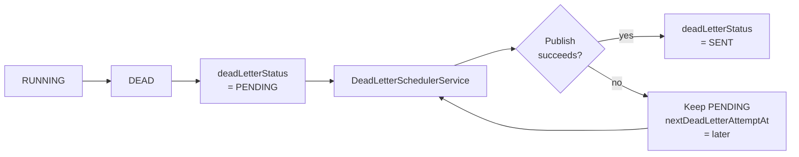
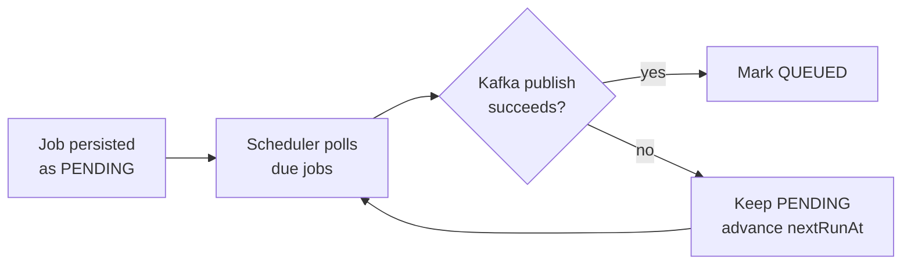
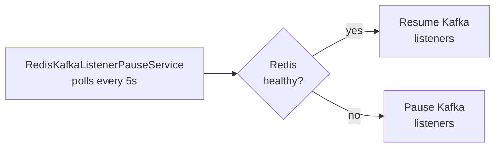
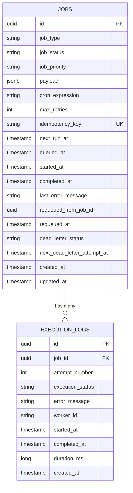

# Distributed Job Scheduler

A Spring Boot based distributed job scheduler that accepts background jobs via a REST API, stores them durably in PostgreSQL, dispatches due jobs to Kafka, and processes them with workers. Built to demonstrate how production schedulers handle durability, retries, observability, and recovery from real failure modes.

---

## Table of Contents

- [Architecture](#architecture)
- [Request Flow](#request-flow)
- [Job Lifecycle](#job-lifecycle)
- [Scheduling Patterns](#scheduling-patterns)
- [Reliability Features](#reliability-features)
- [REST API](#rest-api)
- [Job Types](#job-types)
- [Persistence Model](#persistence-model)
- [Kafka Topics and Redis Keys](#kafka-topics-and-redis-keys)
- [Configuration](#configuration)
- [Package Layout](#package-layout)
- [Status](#status)
- [System Design Talking Points](#system-design-talking-points)
- [Local Verification](#local-verification)

---

## Architecture

The API never depends on Kafka being available. Jobs are written to PostgreSQL first with a `nextRunAt` timestamp. A scheduler component polls for due jobs and dispatches them to Kafka asynchronously. PostgreSQL is the source of truth; Kafka is the delivery mechanism.



---

## Request Flow



---

## Job Lifecycle



| Status | Meaning |
|---|---|
| `PENDING` | Stored in DB, waiting for `nextRunAt` |
| `QUEUED` | Kafka accepted the job; awaiting worker pickup |
| `RUNNING` | Worker is actively processing |
| `SUCCESS` | Terminal success for one-time jobs |
| `FAILED` | Transient failure before retry or `DEAD` |
| `DEAD` | Terminal failure after max attempts or permanent error |
| `CANCELED` | Reserved for future cancellation support |

---

## Scheduling Patterns

### Immediate Jobs



### Cron Jobs

Spring cron expressions use 6 fields, including seconds. Example: `0 */5 * * * *` runs every 5 minutes.



### Retryable Failures

Retry delay follows exponential backoff: `1s`, `2s`, `4s`, and so on, capped by configuration.



### Permanent Failures and Dead Letter

Permanent failures include missing jobs, invalid payloads, unsupported job types, and max attempts exceeded.



---

## Reliability Features

### DB-Backed Dispatch

Jobs survive Kafka outages. If Kafka is unavailable at dispatch time, the job stays `PENDING` and the scheduler retries later.



### Watchdogs

Two independent watchdogs recover jobs from different stuck states:

| Watchdog | Trigger | Recovery |
|---|---|---|
| `QUEUED` watchdog | Job stuck `QUEUED` past timeout | Reset to `PENDING`, `nextRunAt = now` |
| `RUNNING` watchdog | Job stuck `RUNNING` past timeout | Reset to `PENDING`, `nextRunAt = now` |

### Redis Locking With Lua

Workers use Redis locks with Lua scripts to ensure ownership-safe release and renewal. A worker only releases or renews a lock if it still holds the exact token.

Lock value format:

```text
workerId:randomUUID
```

This prevents a worker from deleting another worker's lock after TTL expiry and reacquisition.

### Redis-Aware Kafka Pause

Workers depend on Redis for locking and idempotency. `RedisKafkaListenerPauseService` monitors Redis health and pauses Kafka consumers when Redis is unavailable, then resumes them once healthy.



### Idempotency Marker

Completed one-time jobs write a `job-done:{jobId}` key to Redis with a 24 hour TTL. If Kafka redelivers the same event, the worker checks this marker and skips already-completed work.

### External Call Timeouts

Webhook and mail sends have explicit timeouts to prevent worker threads from hanging indefinitely on stuck dependencies.

---

## REST API

Base path: `/app/v1/jobs`

| Method | Path | Purpose |
|---|---|---|
| `POST` | `/app/v1/jobs` | Submit a new job |
| `GET` | `/app/v1/jobs` | List jobs, newest first |
| `GET` | `/app/v1/jobs/dead` | List dead jobs |
| `GET` | `/app/v1/jobs/{jobId}` | Get job detail |
| `GET` | `/app/v1/jobs/{jobId}/logs` | Get execution logs |
| `POST` | `/app/v1/jobs/{jobId}/requeue` | Re-create a dead job |

### Example Requests

Immediate webhook:

```json
{
  "jobType": "WEBHOOK",
  "jobPriority": "HIGH",
  "payload": {
    "url": "https://example.com/webhook",
    "body": { "event": "demo" }
  },
  "maxRetries": 3,
  "idempotencyKey": "webhook-demo-001"
}
```

Recurring webhook:

```json
{
  "jobType": "WEBHOOK",
  "jobPriority": "MEDIUM",
  "cronExpression": "0 */5 * * * *",
  "payload": {
    "url": "https://example.com/webhook",
    "body": { "event": "cron-demo" }
  },
  "maxRetries": 3,
  "idempotencyKey": "webhook-cron-demo-001"
}
```

Cleanup job:

```json
{
  "jobType": "CLEANUP",
  "jobPriority": "LOW",
  "payload": { "olderThanDays": 30 },
  "maxRetries": 3,
  "idempotencyKey": "cleanup-logs-30-days"
}
```

---

## Job Types

| Type | Status | Purpose |
|---|---|---|
| `SEND_EMAIL` | Implemented | Sends email via Spring Mail |
| `WEBHOOK` | Implemented | Sends HTTP POST with JSON payload |
| `CLEANUP` | Implemented | Deletes old execution logs |

Planned future handlers include `REPORT` and `SCRAPE`.

---

## Persistence Model



`jobs` stores one row per submitted job. Key columns:

| Column | Purpose |
|---|---|
| `next_run_at` | When the scheduler should dispatch this job |
| `queued_at` | When Kafka accepted the job |
| `started_at` | When the worker began processing |
| `completed_at` | Terminal completion timestamp |
| `last_error_message` | Last failure reason or watchdog recovery note |
| `dead_letter_status` | DLQ publish state, such as `PENDING` or `SENT` |
| `next_dead_letter_attempt_at` | Next DLQ retry time |
| `requeued_from_job_id` | Source dead job when manually requeued |

`execution_logs` stores one row per attempt. It tracks duration, worker ID, status, and error per execution.

---

## Kafka Topics and Redis Keys

### Kafka Topics

| Topic | Purpose |
|---|---|
| `job-queue` | Standard-priority jobs |
| `job-queue-high` | High-priority jobs |
| `job-dlq` | Dead-letter queue |

`HIGH` priority jobs route to `job-queue-high`; all others go to `job-queue`.

### Redis Keys

| Key | Purpose | TTL |
|---|---|---|
| `job-lock:{jobId}` | Worker execution lock, renewed while running | 30s |
| `job-done:{jobId}` | Idempotency marker for completed one-time jobs | 24h |

---

## Configuration

```properties
# Scheduler toggle. Only one instance should run scheduling.
scheduler.enabled=true
scheduler.worker-id=worker-1

# Retry backoff
scheduler.retry.base-delay-ms=1000
scheduler.retry.max-delay-ms=30000

# Due-job poller
scheduler.due-job.poll-delay-ms=1000
scheduler.due-job.dispatch-retry-delay-ms=5000

# Watchdogs
scheduler.queued-watchdog.timeout-ms=300000
scheduler.queued-watchdog.poll-delay-ms=60000
scheduler.running-watchdog.timeout-ms=600000
scheduler.running-watchdog.poll-delay-ms=60000

# Redis health and Kafka pause
scheduler.redis-health.poll-delay-ms=5000
scheduler.kafka.redis-retry-backoff-ms=5000

# Dead-letter scheduler
scheduler.dead-letter.poll-delay-ms=30000
scheduler.dead-letter.dispatch-retry-delay-ms=30000

# Webhook timeouts
scheduler.webhook.connect-timeout-ms=5000
scheduler.webhook.read-timeout-ms=10000

# Mail timeouts
spring.mail.properties.mail.smtp.connectiontimeout=5000
spring.mail.properties.mail.smtp.timeout=10000
spring.mail.properties.mail.smtp.writetimeout=10000
```

Scheduler mode: set `scheduler.enabled=true` on exactly one instance. Additional API/worker instances should use `false` to avoid duplicate DB polling. A future improvement can replace this with leader election or atomic row claiming.

---

## Package Layout

```text
config/       HTTP client, Kafka topics, error handling
constants/    Kafka topic name constants
consumers/    Kafka listeners
controller/   REST API
dto/          Request/event/response DTOs, typed payload records
entity/       JPA entities
enums/        JobStatus, JobType, JobPriority, DeadLetterStatus
exception/    Domain exceptions
handlers/     Per-job-type handlers and JobHandlerRouter
monitoring/   Redis-aware Kafka listener pause/resume
producers/    Kafka producer wrapper
repository/   Spring Data JPA repositories
scheduler/    Due-job dispatcher, watchdogs, DLQ publisher
service/      Job lifecycle, worker, Redis lock, execution logs, Redis health
utility/      Key builders for locks and done markers
```

---

## Status

### Done

- Job submission, listing, detail, and execution log APIs
- Dead job listing and manual requeue API
- Typed payload validation for email, webhook, and cleanup
- PostgreSQL entities with indexes for scheduler and status queries
- DB-backed due-job dispatch
- Kafka producer and consumer flow
- High-priority and normal queue routing
- Durable dead-letter publishing with PostgreSQL-backed retry state
- Redis lock with Lua ownership-safe release and renewal
- Redis idempotency marker for completed one-time jobs
- Redis health checks and Kafka listener pause/resume
- Per-attempt execution logs
- Exponential backoff via `nextRunAt`
- Cron scheduling with Spring `CronExpression`
- `QUEUED` and `RUNNING` watchdogs
- Single-scheduler-instance flag
- `SEND_EMAIL`, `WEBHOOK`, and `CLEANUP` handlers

### Up Next

- Runtime configuration profiles for Kafka, Redis, PostgreSQL, and Mail
- Unit and integration tests for worker lifecycle, retry, cron, watchdogs, DLQ, and handler routing
- Testcontainers for integration tests
- Docker Compose for local infrastructure
- Rename `maxRetries` to `maxAttempts` for accuracy

### Feature Roadmap

- `REPORT` and `SCRAPE` handler implementations
- SSE live updates for job status
- Metrics: success rate, average duration, jobs per status/type
- Pagination and filtering on list APIs
- Structured API error responses
- GitHub Actions CI
- React dashboard

### Production Hardening

- Leader election or atomic DB row claiming to replace the single-scheduler flag
- Stronger concurrency protection around due-job claiming
- Authentication and authorization for job management APIs

---

## System Design Talking Points

- PostgreSQL is the source of truth. The API writes jobs to the DB before any Kafka interaction, so jobs survive Kafka outages at submission time.
- Kafka provides async fan-out. Kafka is the delivery layer; PostgreSQL holds the canonical state.
- `nextRunAt` unifies scheduling. Immediate jobs, retries, and cron jobs all use the same scheduling column.
- `QUEUED` is a distinct state. It separates "Kafka accepted this" from "a worker started this."
- Two watchdogs recover two failure windows. The `QUEUED` watchdog handles jobs that were dispatched but never picked up. The `RUNNING` watchdog handles worker crashes mid-execution.
- Redis locks reduce duplicate execution under Kafka's at-least-once delivery model.
- Lua scripts make lock operations ownership-safe.
- Redis health checks pause Kafka consumption when locks and idempotency checks cannot be trusted.
- Dead-letter state is durable. DLQ publish failures are retried from PostgreSQL state, not memory.

---

## Local Verification

```bash
# Compile only. No local infrastructure required.
mvn -DskipTests compile
```

Full tests require PostgreSQL, Kafka, and Redis. Add Testcontainers or a test profile before running `mvn test` in CI.
