# Distributed Job Scheduler

A distributed job scheduler that handles what happens when things go wrong — Kafka outages, worker crashes, duplicate delivery, and permanent failures.

Jobs are accepted through a Spring Boot REST API, stored durably in PostgreSQL, dispatched asynchronously through Kafka, coordinated with Redis locks, and recovered by watchdog services when workers or infrastructure fail mid-flow.

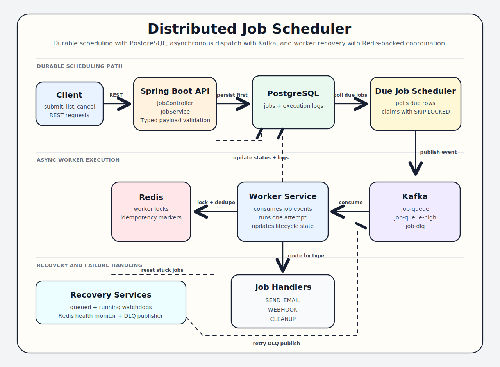

---

## Table of Contents

- [Getting Started](#getting-started)
- [Architecture](#architecture)
- [Request Flow](#request-flow)
- [Job Lifecycle](#job-lifecycle)
- [Scheduling Patterns](#scheduling-patterns)
- [Reliability Features](#reliability-features)
- [REST API](#rest-api)
- [Job Types](#job-types)
- [Persistence Model](#persistence-model)
- [Kafka Topics and Redis Keys](#kafka-topics-and-redis-keys)
- [Configuration](#configuration)
- [Package Layout](#package-layout)
- [Implemented Capabilities](#implemented-capabilities)
- [System Design Talking Points](#system-design-talking-points)
- [Testing and CI](#testing-and-ci)

---

## Getting Started

Run the full scheduler stack locally with Docker Compose:

```bash
git clone https://github.com/harshithrao07/distributed-scheduler.git scheduler
cd scheduler
docker compose up --build -d
```

Then run the test suite:

```bash
mvn test
```

Useful local URLs:

- API base URL: `http://localhost:8080/app/v1`
- Swagger UI: `http://localhost:8080/swagger-ui.html`
- OpenAPI JSON: `http://localhost:8080/v3/api-docs`
- Health: `http://localhost:8080/actuator/health`
- Prometheus metrics: `http://localhost:8080/actuator/prometheus`

Local services:

| Service | Port | Purpose |
|---|---:|---|
| App | `8080` | Spring Boot REST API, schedulers, workers |
| PostgreSQL | `5432` | Durable job and execution log storage |
| Kafka | `9092` | Job queue, high-priority queue, and DLQ |
| Redis | `6379` | Worker locks and idempotency markers |
| Prometheus | `9090` | Scrapes application and scheduler metrics |

Stop the stack with `docker compose down`. Use `docker compose down -v` when you want a clean database, Kafka log, and Redis state.

---

## Architecture

The API never depends on Kafka being available. Jobs are written to PostgreSQL first with a `nextRunAt` timestamp. A scheduler component polls for due jobs and dispatches them to Kafka asynchronously. PostgreSQL is the source of truth; Kafka is the delivery mechanism.

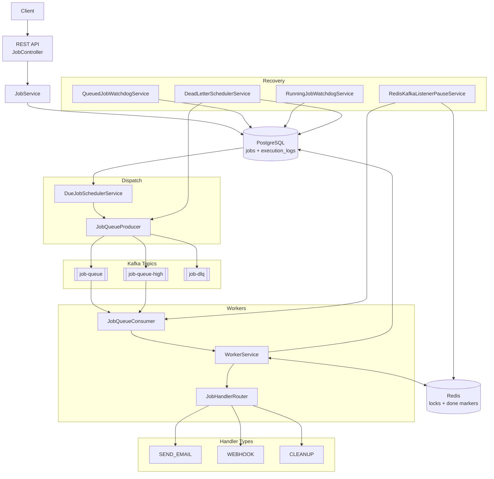

---

## Request Flow

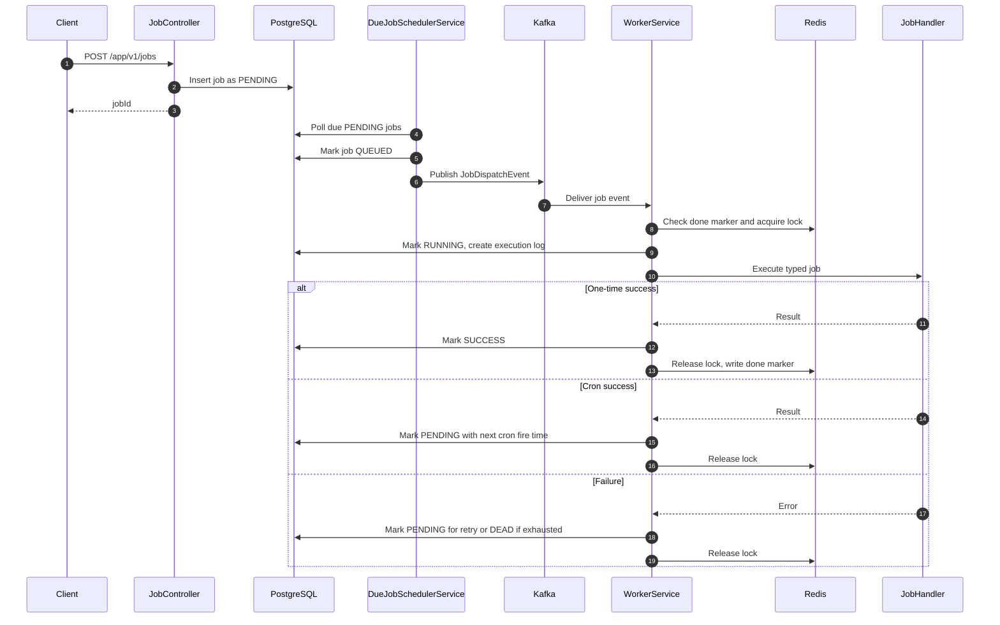

---

## Job Lifecycle

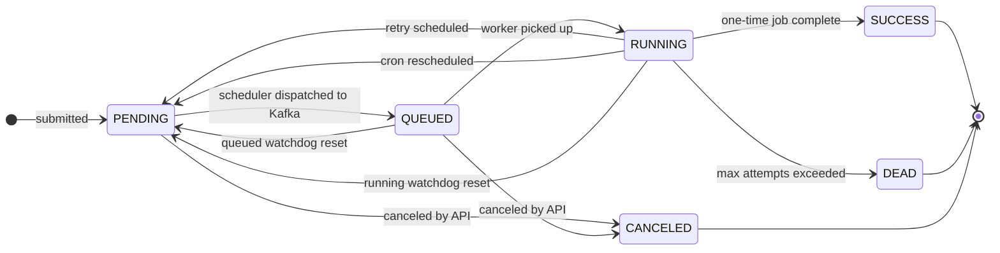

| Status | Meaning |
|---|---|
| `PENDING` | Stored in DB, waiting for `nextRunAt` |
| `QUEUED` | Kafka accepted the job; awaiting worker pickup |
| `RUNNING` | Worker is actively processing |
| `SUCCESS` | Terminal success for one-time jobs |
| `FAILED` | Transient failure before retry or `DEAD` |
| `DEAD` | Terminal failure after max attempts or permanent error |
| `CANCELED` | Terminal state for jobs canceled before execution starts |

---

## Scheduling Patterns

### Immediate Jobs

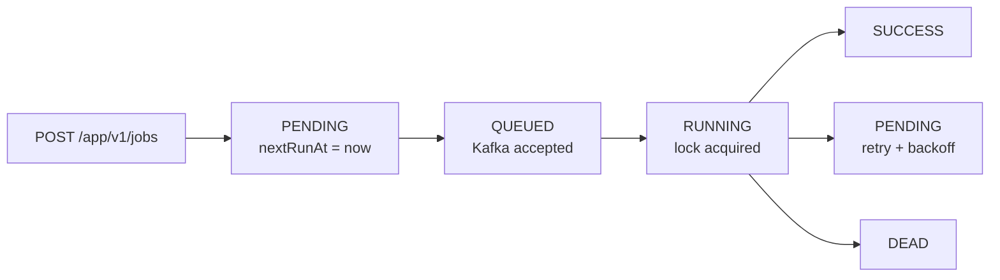

### Cron Jobs

Spring cron expressions use 6 fields, including seconds. Example: `0 */5 * * * *` runs every 5 minutes.

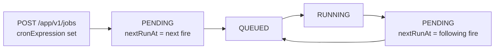

### Retryable Failures

Retry delay follows exponential backoff: `1s`, `2s`, `4s`, and so on, capped by configuration.

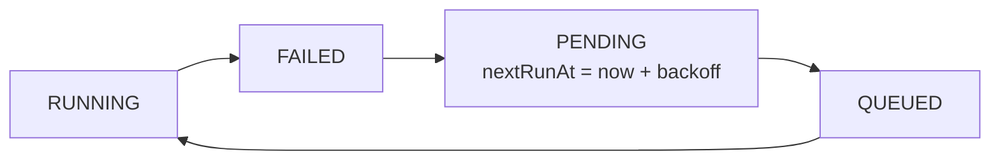

### Permanent Failures and Dead Letter

Permanent failures include missing jobs, invalid payloads, unsupported job types, and max attempts exceeded.

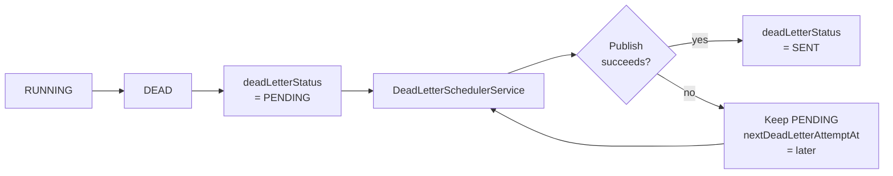

---

## Reliability Features

### DB-Backed Dispatch

Jobs survive Kafka outages. If Kafka is unavailable at dispatch time, the job stays `PENDING` and the scheduler retries later.

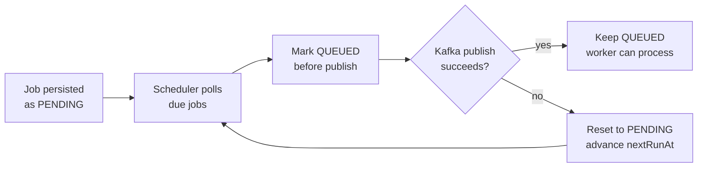

### Watchdogs

Two independent watchdogs recover jobs from different stuck states:

| Watchdog | Trigger | Recovery |
|---|---|---|
| `QUEUED` watchdog | Job stuck `QUEUED` past timeout | Reset to `PENDING`, `nextRunAt = now` |
| `RUNNING` watchdog | Job stuck `RUNNING` past timeout | Reset to `PENDING`, `nextRunAt = now` |

### Redis Locking With Lua

Workers use Redis locks with Lua scripts to ensure ownership-safe release and renewal. A worker only releases or renews a lock if it still holds the exact token.

Lock value format:

```text
workerId:randomUUID
```

This prevents a worker from deleting another worker's lock after TTL expiry and reacquisition.

### Redis-Aware Kafka Pause

Workers depend on Redis for locking and idempotency. `RedisKafkaListenerPauseService` monitors Redis health and pauses Kafka consumers when Redis is unavailable, then resumes them once healthy.

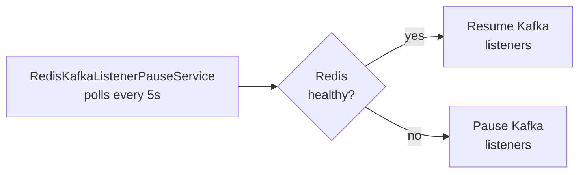

### Idempotency Marker

Completed one-time jobs write a `job-done:{idempotencyKey}` key to Redis with a 24 hour TTL. If Kafka redelivers the same logical job, the worker checks this marker and skips already-completed work. Execution locking still uses `job-lock:{jobId}` so in-flight coordination stays tied to the queued record, while completion dedupe stays tied to the logical job identity. Cron jobs intentionally do not write a done-marker, and manual requeues generate a fresh `idempotencyKey` so they run as new logical executions.

### External Call Timeouts

Webhook and mail sends have explicit timeouts to prevent worker threads from hanging indefinitely on stuck dependencies.

---

## REST API

OpenAPI documentation is generated automatically from the Spring MVC controllers.

- Swagger UI: `http://localhost:8080/swagger-ui.html`
- OpenAPI JSON: `http://localhost:8080/v3/api-docs`
- Health: `http://localhost:8080/actuator/health`
- Prometheus metrics: `http://localhost:8080/actuator/prometheus`

| Method | Path | Purpose |
|---|---|---|
| `POST` | `/app/v1/jobs` | Submit a new job |
| `GET` | `/app/v1/jobs` | List jobs with pagination and optional filters |
| `GET` | `/app/v1/jobs/dead` | List dead jobs |
| `GET` | `/app/v1/jobs/{jobId}` | Get job detail |
| `GET` | `/app/v1/jobs/{jobId}/logs` | Get execution logs |
| `POST` | `/app/v1/jobs/{jobId}/requeue` | Re-create a dead job |
| `POST` | `/app/v1/jobs/{jobId}/cancel` | Cancel a pending or queued job |
| `GET` | `/app/v1/dlq` | Inspect dead-letter jobs with pagination and filters |
| `GET` | `/app/v1/dlq/{jobId}` | Inspect one dead-letter job with execution logs |

### Metrics

Prometheus metrics are exposed through Spring Boot Actuator:

- Prometheus scrape endpoint: `http://localhost:8080/actuator/prometheus`
- Prometheus UI: `http://localhost:9090`

Scheduler-specific metrics:

| Metric | Type | Purpose |
|---|---|---|
| `scheduler_jobs_submitted_total` | Counter | Jobs accepted by the API |
| `scheduler_jobs_dispatched_total` | Counter | Jobs successfully published to Kafka |
| `scheduler_jobs_executed_total` | Counter | Worker executions by result |
| `scheduler_job_execution_seconds` | Timer | Worker handler execution duration |
| `scheduler_jobs_dead_lettered_total` | Counter | Jobs moved to DEAD/DLQ state |
| `scheduler_jobs_requeued_total` | Counter | Dead jobs requeued by API |
| `scheduler_jobs_canceled_total` | Counter | Jobs canceled by API |
| `scheduler_jobs_status` | Gauge | Current job count by status |

Useful PromQL examples:

```promql
rate(scheduler_jobs_submitted_total[5m])
rate(scheduler_jobs_executed_total{result="SUCCESS"}[5m])
rate(scheduler_jobs_executed_total{result="FAILED"}[5m])
scheduler_jobs_status{status="PENDING"}
scheduler_jobs_status{status="DEAD"}
histogram_quantile(0.95, rate(scheduler_job_execution_seconds_bucket[5m]))
```

### List Jobs Query Parameters

`GET /app/v1/jobs` returns a paginated response sorted by newest jobs first.

| Parameter | Required | Example | Purpose |
|---|---|---|---|
| `status` | No | `PENDING` | Filter by job status |
| `type` | No | `WEBHOOK` | Filter by job type |
| `priority` | No | `HIGH` | Filter by job priority |
| `createdFrom` | No | `2026-04-01T00:00:00Z` | Include jobs created at or after this time |
| `createdTo` | No | `2026-04-22T23:59:59Z` | Include jobs created at or before this time |
| `page` | No | `0` | Zero-based page number. Defaults to `0` |
| `size` | No | `20` | Page size. Defaults to `20`, capped at `100` |

Example:

```text
GET /app/v1/jobs?status=PENDING&type=WEBHOOK&priority=HIGH&page=0&size=10
```

Response shape:

```json
{
  "content": [],
  "page": 0,
  "size": 10,
  "totalElements": 0,
  "totalPages": 0,
  "first": true,
  "last": true
}
```

### Idempotent Submission

`POST /app/v1/jobs` treats `idempotencyKey` as the logical identity for one-time submissions. If the same key is submitted again, the API returns the existing job ID instead of surfacing a raw database uniqueness failure. Manual requeues intentionally create a fresh `idempotencyKey`, and cron jobs still use their stored key only for submission identity, not for recurring-run completion markers.

### Cancellation

`POST /app/v1/jobs/{jobId}/cancel` cancels jobs that have not started running yet.

Cancelable states:

| State | Behavior |
|---|---|
| `PENDING` | Marked `CANCELED` and removed from scheduling |
| `QUEUED` | Marked `CANCELED`; if Kafka later delivers the event, the worker skips it |

Already terminal jobs and currently `RUNNING` jobs are rejected.

### DLQ Inspection

`GET /app/v1/dlq` returns only `DEAD` jobs and includes DLQ publish metadata, attempt counts, final errors, and requeue metadata.

| Parameter | Required | Example | Purpose |
|---|---|---|---|
| `deadLetterStatus` | No | `PENDING` | Filter by DLQ publish state |
| `type` | No | `WEBHOOK` | Filter by job type |
| `priority` | No | `HIGH` | Filter by job priority |
| `createdFrom` | No | `2026-04-01T00:00:00Z` | Include jobs created at or after this time |
| `createdTo` | No | `2026-04-22T23:59:59Z` | Include jobs created at or before this time |
| `page` | No | `0` | Zero-based page number. Defaults to `0` |
| `size` | No | `20` | Page size. Defaults to `20`, capped at `100` |

Example:

```text
GET /app/v1/dlq?deadLetterStatus=PENDING&type=WEBHOOK&page=0&size=10
```

Summary response items include:

```json
{
  "jobId": "4b77f1d2-0000-0000-0000-000000000000",
  "jobType": "WEBHOOK",
  "jobPriority": "HIGH",
  "lastErrorMessage": "Max attempts exceeded",
  "attemptCount": 3,
  "deadLetterStatus": "PENDING",
  "deadLetterQueuedAt": "2026-04-22T03:30:10Z",
  "deadLetterSentAt": null,
  "deadLetterLastAttemptAt": "2026-04-22T03:30:12Z",
  "nextDeadLetterAttemptAt": "2026-04-22T03:30:42Z",
  "deadLetterErrorMessage": "Kafka timeout",
  "requeuedFromJobId": null,
  "requeuedAt": null
}
```

`GET /app/v1/dlq/{jobId}` returns the full payload, final error, DLQ metadata, execution logs, and action flags such as `canRequeue` and `canRetryDeadLetterPublish`.

### Example Requests

Immediate webhook:

```json
{
  "jobType": "WEBHOOK",
  "jobPriority": "HIGH",
  "payload": {
    "url": "https://example.com/webhook",
    "body": { "event": "demo" }
  },
  "maxAttempts": 3,
  "idempotencyKey": "webhook-demo-001"
}
```

Recurring webhook:

```json
{
  "jobType": "WEBHOOK",
  "jobPriority": "MEDIUM",
  "cronExpression": "0 */5 * * * *",
  "payload": {
    "url": "https://example.com/webhook",
    "body": { "event": "cron-demo" }
  },
  "maxAttempts": 3,
  "idempotencyKey": "webhook-cron-demo-001"
}
```

Cleanup job:

```json
{
  "jobType": "CLEANUP",
  "jobPriority": "LOW",
  "payload": { "olderThanDays": 30 },
  "maxAttempts": 3,
  "idempotencyKey": "cleanup-logs-30-days"
}
```

---

## Job Types

| Type | Status | Purpose |
|---|---|---|
| `SEND_EMAIL` | Implemented | Sends email via Spring Mail |
| `WEBHOOK` | Implemented | Sends HTTP POST with JSON payload |
| `CLEANUP` | Implemented | Deletes old execution logs |

---

## Persistence Model

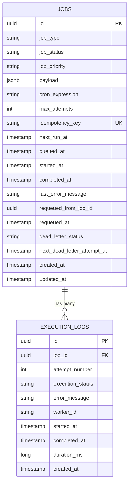

`jobs` stores one row per submitted job. Key columns:

| Column | Purpose |
|---|---|
| `next_run_at` | When the scheduler should dispatch this job |
| `queued_at` | When Kafka accepted the job |
| `started_at` | When the worker began processing |
| `completed_at` | Terminal completion timestamp |
| `last_error_message` | Last failure reason or watchdog recovery note |
| `dead_letter_status` | DLQ publish state, such as `PENDING` or `SENT` |
| `next_dead_letter_attempt_at` | Next DLQ retry time |
| `requeued_from_job_id` | Source dead job when manually requeued |

`execution_logs` stores one row per attempt. It tracks duration, worker ID, status, and error per execution.

---

## Kafka Topics and Redis Keys

### Kafka Topics

| Topic | Purpose |
|---|---|
| `job-queue` | Standard-priority jobs |
| `job-queue-high` | High-priority jobs |
| `job-dlq` | Dead-letter queue |

`HIGH` priority jobs route to `job-queue-high`; all others go to `job-queue`.

### Redis Keys

| Key | Purpose | TTL |
|---|---|---|
| `job-lock:{jobId}` | Worker execution lock, renewed while running | 30s |
| `job-done:{idempotencyKey}` | Idempotency marker for completed one-time jobs | 24h |

---

## Configuration

```properties
# Shared defaults
spring.profiles.default=local
scheduler.enabled=${SCHEDULER_ENABLED:true}
scheduler.worker-id=${SCHEDULER_WORKER_ID:worker-1}

# Kafka serialization
spring.kafka.producer.key-serializer=org.apache.kafka.common.serialization.UUIDSerializer
spring.kafka.producer.value-serializer=org.springframework.kafka.support.serializer.JsonSerializer
spring.kafka.consumer.key-deserializer=org.apache.kafka.common.serialization.UUIDDeserializer
spring.kafka.consumer.value-deserializer=org.springframework.kafka.support.serializer.JsonDeserializer
spring.kafka.consumer.properties.spring.json.value.default.type=com.job.scheduler.dto.JobDispatchEvent
spring.kafka.consumer.properties.spring.json.trusted.packages=com.job.scheduler.dto,com.job.scheduler.enums
spring.kafka.consumer.auto-offset-reset=earliest

# Actuator
management.endpoints.web.exposure.include=health,info,prometheus
management.endpoint.health.probes.enabled=true
management.endpoint.health.show-components=always
management.endpoint.health.show-details=never
management.health.discovery.enabled=false
management.health.redis.enabled=true
management.info.env.enabled=true

# Retry backoff
scheduler.retry.base-delay-ms=1000
scheduler.retry.max-delay-ms=30000

# Due-job poller
scheduler.due-job.poll-delay-ms=5000
scheduler.due-job.dispatch-retry-delay-ms=5000
scheduler.due-job.claim-limit=100

# Watchdogs
scheduler.queued-watchdog.timeout-ms=300000
scheduler.queued-watchdog.poll-delay-ms=60000
scheduler.running-watchdog.timeout-ms=600000
scheduler.running-watchdog.poll-delay-ms=60000

# Redis health and Kafka pause
scheduler.redis-health.poll-delay-ms=5000
scheduler.kafka.redis-retry-backoff-ms=5000

# Dead-letter scheduler
scheduler.dead-letter.poll-delay-ms=30000
scheduler.dead-letter.dispatch-retry-delay-ms=30000

# Webhook timeouts
scheduler.webhook.connect-timeout-ms=5000
scheduler.webhook.read-timeout-ms=10000

# Mail timeouts
spring.mail.properties.mail.smtp.connectiontimeout=5000
spring.mail.properties.mail.smtp.timeout=10000
spring.mail.properties.mail.smtp.writetimeout=10000
```

Profile-specific configuration lives in:

- `application-local.properties` - local PostgreSQL, Kafka, and Redis
- `application-test.properties` - test-focused defaults
- `application-prod.properties` - environment-variable-driven production settings

Due-job dispatch uses atomic PostgreSQL row claiming with `FOR UPDATE SKIP LOCKED`. Multiple scheduler instances can run with `scheduler.enabled=true`; each poll claims a bounded batch of due `PENDING` jobs and moves them to `QUEUED` before publishing to Kafka. That ordering prevents a fast Kafka consumer from seeing a still-`PENDING` job. If publish fails, the scheduler resets the job to `PENDING` and makes it due again after `scheduler.due-job.dispatch-retry-delay-ms`.

---

## Package Layout

```text
config/       HTTP client, Kafka topics, error handling
constants/    Kafka topic name constants
consumers/    Kafka listeners
controller/   REST API
dto/          Request/event/response DTOs, typed payload records
entity/       JPA entities
enums/        JobStatus, JobType, JobPriority, DeadLetterStatus
exception/    Domain exceptions
handlers/     Per-job-type handlers and JobHandlerRouter
monitoring/   Health indicators, metrics, events, and Redis-aware Kafka listener pause/resume
producers/    Kafka producer wrapper
repository/   Spring Data JPA repositories
scheduler/    Due-job dispatcher, watchdogs, DLQ publisher
service/      Job lifecycle, worker, Redis lock, execution logs, Redis health
utility/      Key builders for locks and done markers
```

---

## Implemented Capabilities

- Job submission, listing, detail, and execution log APIs
- Dead job listing, DLQ inspection, manual requeue, and cancellation APIs
- Typed payload validation for email, webhook, and cleanup
- PostgreSQL entities with indexes for scheduler and status queries
- DB-backed due-job dispatch
- Kafka producer and consumer flow
- High-priority and normal queue routing
- Durable dead-letter publishing with PostgreSQL-backed retry state
- DLQ inspection views with attempt counts, final errors, and publish retry metadata
- Redis lock with Lua ownership-safe release and renewal
- Redis idempotency marker for completed one-time jobs
- Redis health checks and Kafka listener pause/resume
- Per-attempt execution logs
- Exponential backoff via `nextRunAt`
- Cron scheduling with Spring `CronExpression`
- `QUEUED` and `RUNNING` watchdogs
- Single-scheduler-instance flag
- `SEND_EMAIL`, `WEBHOOK`, and `CLEANUP` handlers
- Docker Compose for the full local stack: app, PostgreSQL, Kafka, and Redis
- Spring Boot Actuator health and info endpoints
- Prometheus scrape endpoint and Docker Compose Prometheus service
- Scheduler-specific Prometheus metrics backed by domain events
- Pagination and filtering for the job list API
- Cancellation support for pending and queued jobs
- Unit tests for services, handlers, producers, and controllers
- Integration tests with Testcontainers for PostgreSQL, Redis, Kafka, concurrency, and failure paths
- JaCoCo coverage reporting and SonarQube analysis wiring
- GitHub Actions CI for Maven tests, coverage artifacts, and optional Sonar analysis
- OpenAPI/Swagger documentation generated by springdoc-openapi
- Runtime configuration profiles for local, test, and production environments
- Duplicate `idempotencyKey` submissions now return the existing job ID instead of leaking a raw uniqueness error

---

## System Design Talking Points

- PostgreSQL is the source of truth. The API writes jobs to the DB before any Kafka interaction, so jobs survive Kafka outages at submission time.
- Kafka provides async fan-out. Kafka is the delivery layer; PostgreSQL holds the canonical state.
- `nextRunAt` unifies scheduling. Immediate jobs, retries, and cron jobs all use the same scheduling column.
- `QUEUED` is a distinct state. It separates "Kafka accepted this" from "a worker started this."
- Two watchdogs recover two failure windows. The `QUEUED` watchdog handles jobs that were dispatched but never picked up. The `RUNNING` watchdog handles worker crashes mid-execution.
- Redis uses two identities on purpose. `jobId` coordinates in-flight locking, while `idempotencyKey` dedupes completed one-time work across Kafka redelivery.
- Lua scripts make lock operations ownership-safe.
- Redis health checks pause Kafka consumption when locks and idempotency checks cannot be trusted.
- Dead-letter state is durable. DLQ publish failures are retried from PostgreSQL state, not memory.

---

## Testing and CI

The test suite uses Testcontainers for integration coverage. Make sure Docker is running before executing:

```bash
mvn test
```

To generate coverage and send analysis to SonarQube or SonarCloud:

```bash
mvn clean verify sonar:sonar \
  -Dsonar.host.url=http://localhost:9000 \
  -Dsonar.token=your_sonar_token
```

JaCoCo writes the coverage report to `target/site/jacoco/jacoco.xml`, and Surefire writes test results to `target/surefire-reports`.

### Coverage

The tables below are regenerated by `scripts/update-coverage-readme.py` after each `mvn test` run in CI; do not edit between the markers manually.

<!-- COVERAGE-START -->

Latest JaCoCo run across the full Testcontainers-backed suite:

| Metric | Covered | Total | Coverage |
|---|---:|---:|---:|
| Instructions | 2,803 | 3,726 | 75% |
| Branches | 128 | 197 | 65% |
| Lines | 593 | 844 | 70% |
| Methods | 162 | 203 | 80% |
| Classes | 57 | 58 | 98% |

Per-package instruction coverage:

| Package | Coverage |
|---|---:|
| `scheduler` (due-job, watchdogs, DLQ) | 100% |
| `producers` | 100% |
| `enums` | 100% |
| `monitoring.events` | 100% |
| `dto.payload` | 100% |
| `utility` | 100% |
| `handlers` | 93% |
| `dto` | 91% |
| `controller` | 83% |
| `monitoring` | 81% |
| `exception` | 76% |
| `service` (job lifecycle, worker, locks) | 66% |
| `config` | 53% |
| `consumers` | 50% |

Open `target/site/jacoco/index.html` after `mvn test` for the drill-down view.

<!-- COVERAGE-END -->

### GitHub Actions CI

The repository includes `.github/workflows/ci.yml`. It runs:

- `./mvnw -B test` on every push and pull request
- JaCoCo and Surefire artifact uploads for debugging and coverage review
- On pushes to `main`, regenerates the README Coverage tables from the fresh `jacoco.csv` and commits the diff back as `github-actions[bot]` (skipped on PRs and forks)
- `./mvnw -B clean verify sonar:sonar` when both `SONAR_TOKEN` and the `SONAR_HOST_URL` repository variable are configured

To enable Sonar analysis in GitHub Actions:

1. Add a repository secret named `SONAR_TOKEN`
2. Add a repository variable named `SONAR_HOST_URL`
3. Make sure that SonarQube server is reachable from the GitHub runner; `http://localhost:9000` only works for local runs, not GitHub-hosted runners
